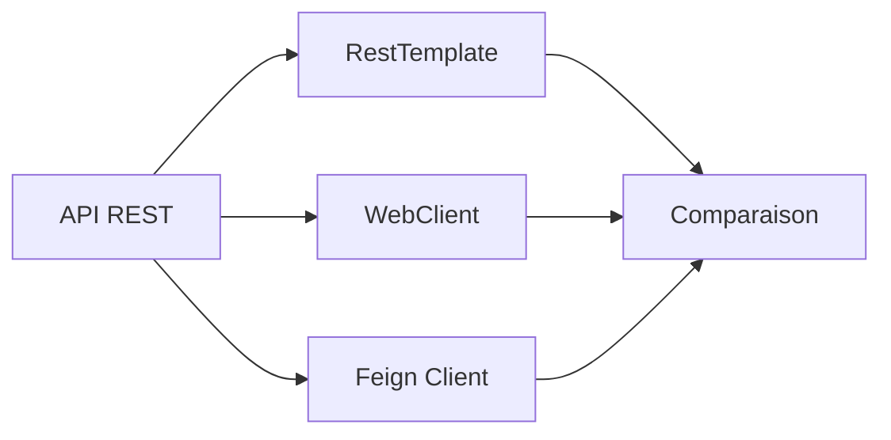

# 🎓 SprinGataTP1 & Clients HTTP

<div align="center">


**Un écosystème Spring Boot complet pour la gestion des étudiants**  
*Comparaison de différentes approches HTTP clients*

[Installation](#-installation-rapide) •
[Architecture](#-architecture) •
[API Reference](#-api-rest) •
[Documentation](#-documentation)

</div>

---

## 📋 Vue d'ensemble

Ce projet illustre un écosystème **Spring Boot** moderne centré sur la gestion des étudiants, avec une architecture multi-clients permettant de comparer différentes approches de consommation d'API REST.

### 🧭 Nouveau : Guide touristique IA (TP3 LangChain4j)

- ✅ Endpoint REST dédié : `GET /api/guide/lieu/{villeOuPays}` avec un paramètre optionnel `nb` pour préciser le nombre de lieux (par défaut `2`).
- 🤖 Intégration LangChain4j + Gemini pour générer du contenu JSON structuré :

```json
{
  "ville_ou_pays": "Nice",
  "endroits_a_visiter": ["Promenade des Anglais", "Vieux Nice"],
  "prix_moyen_repas": "20 EUR"
}
```

- 🔐 Configurez la clé API Gemini via `GEMINI_API_KEY` (variable d'environnement) ou `gemini.api-key` (application.properties).
- 🛟 Aucun secret disponible ? L'application renvoie une réponse de secours expliquant que les données temps réel ne sont pas accessibles.
- 🌐 Exemple de test :

```bash
curl "http://localhost:8080/api/guide/lieu/Maroc?nb=2" | jq
```

### ✨ Composants principaux

| Composant | Description | Technologie |
|-----------|-------------|-------------|
| **🚀 SprinGataTP1** | API REST avec persistance H2 | Spring Data REST + HAL |
| **🔄 AppRestTemplate** | Client HTTP synchrone | RestTemplate |
| **⚡ AppWebClient** | Client HTTP réactif | WebFlux + WebClient |
| **🔌 AppFeignClient** | Client HTTP déclaratif | OpenFeign |

---

## 🎯 Objectifs pédagogiques



- 🔍 Comparer les approches synchrones vs réactives
- 📊 Analyser les performances de chaque client
- 🛠️ Maîtriser Spring Data REST et HAL
- 🎓 Implémenter des patterns HTTP clients modernes

---

## 🏗️ Architecture

```
📦 SprinGataTP1
 ┣ 📂 src/main/java/.../springatatp1
 ┃ ┣ 📜 Etudiant.java              # Entité principale
 ┃ ┣ 📜 Centre.java                # Entité de rattachement
 ┃ ┣ 📜 Genre.java                 # Énumération
 ┃ ┣ 📜 EtudiantRepository.java    # Repository REST
 ┃ ┗ 📜 SprinGataTp1Application.java
 ┣ 📂 AppRestTemplate
 ┃ ┗ 📜 EtudiantClientService.java # Service client REST
 ┣ 📂 AppWebClient                 # 🚧 À compléter
 ┗ 📂 AppFeignClient               # 🚧 À compléter
```

---

## 🚀 Installation rapide

### Prérequis

```bash
☑️ JDK 21+ (recommandé pour SprinGataTP1)
☑️ JDK 17+ (pour les clients)
☑️ Maven Wrapper (inclus)
☑️ Port 8080 disponible
```

### 1️⃣ Démarrage de l'API principale

```bash
cd SprinGataTP1
./mvnw spring-boot:run
```

> 🎉 L'application démarre sur `http://localhost:8080`  
> 📊 Trois étudiants sont automatiquement créés au lancement

### 2️⃣ Démarrage du client RestTemplate

```bash
cd AppRestTemplate
./mvnw spring-boot:run
```

> 🔗 Client disponible sur `http://localhost:8081/client/rest`

### 3️⃣ Implémentation des autres clients

#### WebClient (Réactif)
```bash
cd AppWebClient
# Implémentez EtudiantWebClient.java
./mvnw spring-boot:run
```

#### Feign (Déclaratif)
```bash
cd AppFeignClient
# Annotez EtudiantClient.java avec @FeignClient
./mvnw spring-boot:run
```

---

## 📡 API REST

### Endpoints disponibles

| Méthode | Endpoint | Description |
|---------|----------|-------------|
| `GET` | `/students` | 📋 Liste tous les étudiants |
| `GET` | `/students/{id}` | 👤 Détail d'un étudiant |
| `POST` | `/students` | ➕ Créer un étudiant |
| `PUT` | `/students/{id}` | ✏️ Modifier un étudiant |
| `PATCH` | `/students/{id}` | 🔄 Mise à jour partielle |
| `DELETE` | `/students/{id}` | ❌ Supprimer un étudiant |
| `GET` | `/students/search/findEtudiantByNom?nom=Walid` | 🔍 Recherche par nom |

### 📝 Format HAL

```json
{
  "_embedded": {
    "students": [
      {
        "nom": "Walid",
        "prenom": "Ahmed",
        "genre": "HOMME",
        "_links": {
          "self": {
            "href": "http://localhost:8080/students/1"
          }
        }
      }
    ]
  },
  "_links": {
    "self": {
      "href": "http://localhost:8080/students"
    }
  }
}
```

### 🧪 Exemples de requêtes

#### Créer un étudiant
```bash
curl -X POST http://localhost:8080/students \
  -H "Content-Type: application/json" \
  -d '{
    "nom": "Doe",
    "prenom": "John",
    "genre": "HOMME"
  }'
```

#### Récupérer tous les étudiants
```bash
curl http://localhost:8080/students
```

#### Rechercher par nom
```bash
curl http://localhost:8080/students/search/findEtudiantByNom?nom=Walid
```

---

## 💾 Base de données

### Configuration H2

- **Type** : Base mémoire (in-memory)
- **URL** : `jdbc:h2:mem:testdb`
- **Console web** : Activable via `application.properties`

#### Activer la console H2

```properties
spring.h2.console.enabled=true
spring.h2.console.path=/h2-console
```

Accès : `http://localhost:8080/h2-console`

### 📊 Modèle de données

```sql
┌─────────────┐         ┌─────────────┐
│  CENTRE     │         │  ETUDIANT   │
├─────────────┤         ├─────────────┤
│ id (PK)     │◄────────│ id (PK)     │
│ nom         │    1:N  │ nom         │
│ adresse     │         │ prenom      │
└─────────────┘         │ genre       │
                        │ id_centre   │
                        └─────────────┘
```

### 🎲 Données initiales

| ID | Nom | Prénom | Genre |
|----|-----|--------|-------|
| 1 | Walid | - | HOMME |
| 2 | Amine | - | HOMME |
| 3 | Iness | - | FEMME |

---

## 🔧 Configuration

### Ports par défaut

| Application | Port | Configuration |
|-------------|------|---------------|
| SprinGataTP1 | 8080 | `server.port=8080` |
| AppRestTemplate | 8081 | `server.port=8081` |
| AppWebClient | 8082 | À configurer |
| AppFeignClient | 8083 | À configurer |

### URLs des clients

Modifiez les constantes dans `EtudiantClientService` :

```java
private static final String BASE_URL = "http://localhost:8080/students";
private static final String BASE_URL2 = "http://localhost:8080/students/search";
```

---

## 🧪 Tests

### Exécuter les tests

```bash
./mvnw test
```

### Structure des tests

```
src/test/java
 └── SprinGataTp1ApplicationTests.java
     └── contextLoads()  # Smoke test
```

---

## 🛠️ Guide d'implémentation

### WebClient (Réactif)

```java
@Service
public class EtudiantWebClient {
    
    private final WebClient webClient;
    
    public EtudiantWebClient(WebClient.Builder builder) {
        this.webClient = builder
            .baseUrl("http://localhost:8080")
            .build();
    }
    
    public Mono<Etudiant> getEtudiantById(Long id) {
        return webClient
            .get()
            .uri("/students/{id}", id)
            .retrieve()
            .bodyToMono(Etudiant.class);
    }
    
    public Flux<Etudiant> getAllEtudiants() {
        return webClient
            .get()
            .uri("/students")
            .retrieve()
            .bodyToFlux(Etudiant.class);
    }
}
```

### Feign Client (Déclaratif)

```java
@FeignClient(name = "etudiant-client", url = "http://localhost:8080")
public interface EtudiantClient {
    
    @GetMapping("/students")
    List<Etudiant> getAllEtudiants();
    
    @GetMapping("/students/{id}")
    Etudiant getEtudiantById(@PathVariable Long id);
    
    @PostMapping("/students")
    Etudiant createEtudiant(@RequestBody Etudiant etudiant);
    
    @DeleteMapping("/students/{id}")
    void deleteEtudiant(@PathVariable Long id);
}
```

---

## 📚 Documentation complémentaire

### 🔗 Ressources utiles

- [Spring Data REST Reference](https://docs.spring.io/spring-data/rest/docs/current/reference/html/)
- [HAL - Hypertext Application Language](http://stateless.co/hal_specification.html)
- [WebClient Documentation](https://docs.spring.io/spring-framework/docs/current/reference/html/web-reactive.html#webflux-client)
- [OpenFeign GitHub](https://github.com/OpenFeign/feign)

### 🎯 Outils recommandés

- **Postman** / **Insomnia** : Tester l'API REST
- **HAL Explorer** : Navigator HAL intégré
- **IntelliJ IDEA** / **VS Code** : IDEs recommandés

---

## 🚀 Améliorations futures

- [ ] ✅ Finaliser WebClient et Feign
- [ ] 🔐 Ajouter l'authentification (Spring Security)
- [ ] 📝 Implémenter des DTOs avec validation
- [ ] ⚡ Ajouter un cache (Redis/Caffeine)
- [ ] 📊 Monitoring avec Actuator + Prometheus
- [ ] 🧪 Tests d'intégration complets
- [ ] 🐳 Dockerisation complète
- [ ] 🌐 Migration vers Spring Cloud Config

---

## 📊 Comparaison des clients

| Critère | RestTemplate | WebClient | Feign |
|---------|-------------|-----------|-------|
| **Type** | Synchrone | Réactif | Déclaratif |
| **Performances** | ⭐⭐⭐ | ⭐⭐⭐⭐⭐ | ⭐⭐⭐⭐ |
| **Facilité** | ⭐⭐⭐⭐ | ⭐⭐⭐ | ⭐⭐⭐⭐⭐ |
| **Maintenance** | ⚠️ Déprécié | ✅ Recommandé | ✅ Recommandé |
| **Use Case** | Projets legacy | Haute charge | Microservices |

---

## 👥 Contribution

Les contributions sont les bienvenues ! N'hésitez pas à :

1. 🍴 Fork le projet
2. 🔧 Créer une branche (`git checkout -b feature/AmazingFeature`)
3. 💾 Commit vos changements (`git commit -m 'Add AmazingFeature'`)
4. 📤 Push vers la branche (`git push origin feature/AmazingFeature`)
5. 🔃 Ouvrir une Pull Request

---

## 📄 Licence

Projet académique sans licence explicite.  
Ajoutez un fichier `LICENSE` selon vos besoins.

---

## 📞 Contact & Support

<div align="center">

**Questions ?** Ouvrez une [issue](../../issues) sur GitHub

Made with ❤️ for learning Spring Boot

</div>

---

<div align="center">

### ⭐ N'oubliez pas de star ce projet si vous l'avez trouvé utile !


</div>
